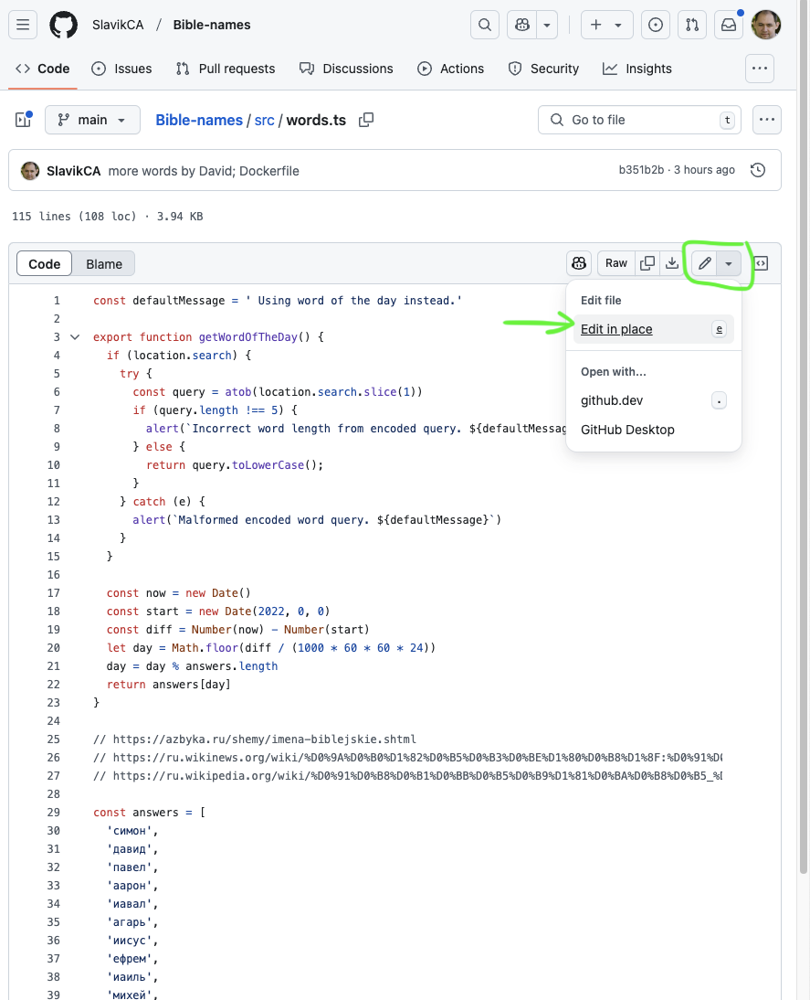

# Игра "Библейские имена-5"

[Библейский имена - 5](https://names.acloud.app/)

[Telegram](https://t.me/RuBibleGames)

Игра, основанная на [Wordle game](https://www.nytimes.com/games/wordle/index.html). 

Вот здесь можно посмотреть все имена, которые используются в игре:
- https://github.com/SlavikCA/Bible-names/blob/main/src/words.ts

Разработка игры не закончена, поэтому мы с радостью готовы принять от вас Pull Requests (запросы с добавленим имён, исправлениями...)  
Это можно сделать отредактировав любой файл:

Планы:
- [ ] сделать landing page, на которой объяснить правила игры
- [ ] сделать возможность игры в команде, друг с другом
- [ ] сделать версию не только на 5, но и на другое количество букв: 4, 6, 7 ...
