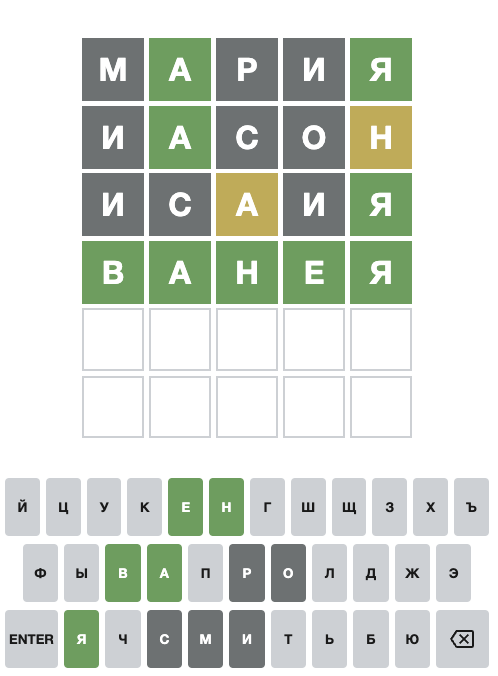

# Игра "Библейские имена-5"

[Telegram канал](https://t.me/RuBibleGames)

Игра, основанная на [Wordle game](https://www.nytimes.com/games/wordle/index.html). 

Вот здесь можно посмотреть все имена, которые используются в игре:
- https://github.com/SlavikCA/Bible-names/blob/main/src/words.ts

Разработка игры не закончена, поэтому мы с радостью готовы принять от вас Pull Requests (запросы с добавлением имён, исправлениями...)  
Это можно сделать отредактировав любой файл:

Планы:
- [ ] сделать landing page, на которой объяснить правила игры
- [ ] собрать более полный список имён
- [ ] соревновательность: считать очки по времени и по количеству неправильных попыток 
- [ ] сделать возможность игры в команде, друг с другом
- [ ] сделать версию не только на 5, но и на другое количество букв: 4, 6, 7 ...
- [ ] показывать дополнительную информация про имена - чем известно то или другой имя
- [ ] сделать иконку / логотип

- [ ] автоматически деплоить из main
- [ ] создавать временные деплои from branches / PR
